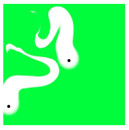

# Coids

Like Boids, but with cows.

## How it works

There is a field of grass and some cows. Each point on the field has a height between 0 and 1. Grass grows and cows eat the grass.

### Grass length

The grass grows logistically. Each cow decreases the length of each point by a ratio based on its distance to that point.

More specifically, if $n$ is the number of cows, $g_{x, y, i}$ is the length of the grass at the $i$-th timestep at point $(x, y)$, $D_{x, y, j}$ is the distance from cow $j$ to point $(x, y)$, and $K$ is some constant, then

$$r = \frac{\tanh(\ln(n + 1))}{K}$$

and

$$S = \prod_{j = 1}^{n}\min\left(1, \frac{D_{x, y, j} + 1}{K^2}\right)$$

and finally,

$$g_{x, y, i} = \left(g_{x, y, i - 1} + g_{x, y, i - 1} \cdot r \cdot \left(1 - g_{x, y, i - 1}\right)\right) \cdot S$$

### Cow positions

Cows move to points based on their grass lengths and distances. Cows move at 1 unit per second.

For each cow $j$, each point is assigned a weight $W_{x, y, i, j}$.

$$W_{x, y, i, j} = \frac{g_{x, y, i}}{D_{x, y, j} + 1}$$

Cow $j$ then moves toward the point with the greatest weight.

## Results

Here's what happens with 2 cows and $K = 5$:

## Further ideas

- Discourage erratic movement by weighting the cosine distance between the cow's current direction and the vector from the cow's position to each point.
- Move to the best area instead of the best point.
- Use a resultant vector based on all weights and scale it down
- Stay away from other cows.
- Make grass lengths decrease from cows more realistically.
